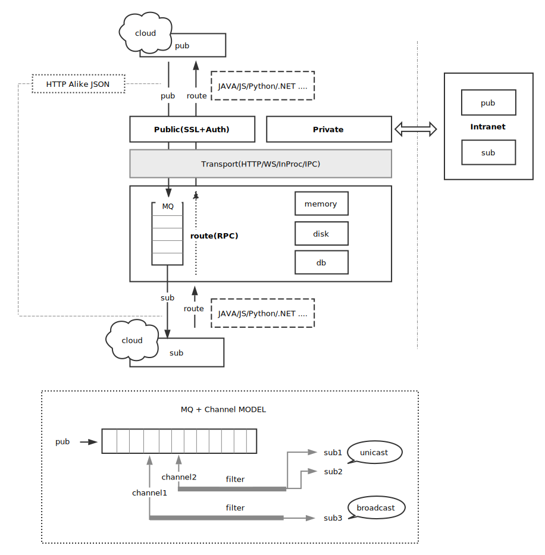

                /\\\       
                \/\\\        
                 \/\\\    
     /\\\\\\\\\\\ \/\\\         /\\\    /\\\  /\\\\\\\\\\     
     \///////\\\/  \/\\\\\\\\\  \/\\\   \/\\\ \/\\\//////     
           /\\\/    \/\\\////\\\ \/\\\   \/\\\ \/\\\\\\\\\\    
          /\\\/      \/\\\  \/\\\ \/\\\   \/\\\ \////////\\\  
         /\\\\\\\\\\\ \/\\\\\\\\\  \//\\\\\\\\\   /\\\\\\\\\\  
         \///////////  \/////////    \/////////   \//////////  

# ZBUS = MQ + RPC  
zbus strives to make Message Queue and Remote Procedure Call fast, light-weighted and easy to build your own service-oriented architecture for many different platforms. Simply put, zbus = mq + rpc.

zbus carefully designed on its protocol and components to embrace KISS(Keep It Simple and Stupid) principle, but in all it delivers power and elasticity. 

## Features
- Fast MQ of disk|memory|db, capable of unicast, multicast and broadcast messaging models
- Easy RPC support out of box 
- HTTP/WebSocket/InProc + JSON simple format, multiple languages support
- SSL + API Auth secured
- Extremely light-weighted (z---bus)
 

 ## Offical Clients

[zbus-js](https://gitee.com/rushmore/zbus-js)

[zbus-python](https://gitee.com/rushmore/zbus-python)

[zbus-java](https://gitee.com/rushmore/zbus) [javadoc](https://apidoc.gitee.com/rushmore/zbus)

[zbus-dotnet](https://gitee.com/rushmore/zbus-dotnet)

## How to start zbus server 
In zbus-dist directory, just run zbus.bat/sh, JDK8+ required. 

Maven

	<dependency>
		<groupId>io.zbus</groupId>
		<artifactId>zbus</artifactId>
		<version>1.0.0-SNAPSHOT</version>
	</dependency>

## Tutorials

### MQ Tutorial
[js](https://gitee.com/rushmore/zbus-js)

[python](https://gitee.com/rushmore/zbus-python)

[java](https://gitee.com/rushmore/zbus)

[dotnet](https://gitee.com/rushmore/zbus-dotnet)

### RPC Tutorial
[js](https://gitee.com/rushmore/zbus-js)

[python](https://gitee.com/rushmore/zbus-python)

[java](https://gitee.com/rushmore/zbus)

[dotnet](https://gitee.com/rushmore/zbus-dotnet)

## High Level Diagram

## Protocol

[MQ Protocol](./doc/MqProtocol.md)

[RPC Protocol](./doc/RpcProtocol.md)